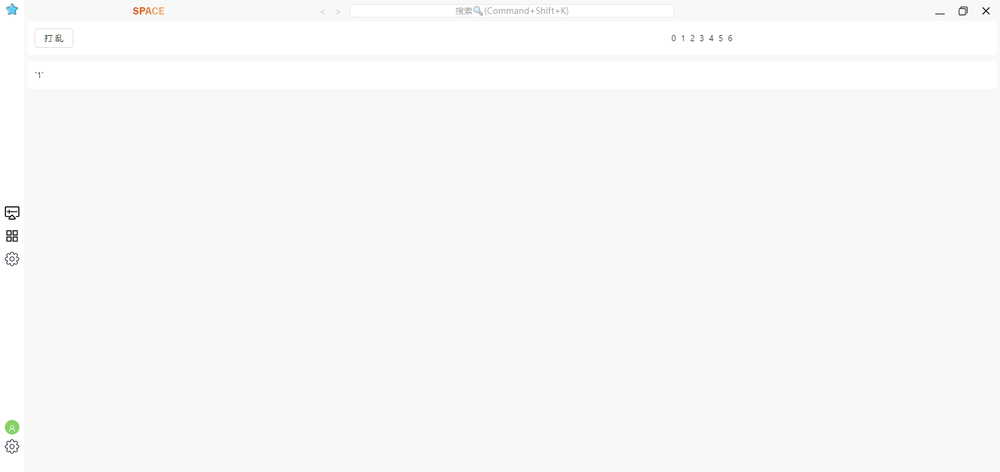

# SPACE

一款基于 Electron, Elecron-Vite, Vue, TypeScript, Socket, Animate, AntDesignVue, Mousetrap, AutoAnimate, Pako, Pinia 等的应用程序

目前正在搭建整个应用程序的整体框架, 为后面的开发打造基础。

目前秉持着高可用, 高扩展的状态编写的代码。

并不会直接开发业务, 而是先创建 Electron 的模板应用, 因此, 如果你现在正需要一个开发模板的话, 这正好能够符合你的需求, 但是你需要明白, 使用别人的搭建的应用模板你需要付出一定的学习时间

首先, 采用 Electron-Vite, 就拥有一些非常醒目的文件夹名称 main， preload， renderer

code -> 主线程核心代码块，存放的是关于Electron的服务封装，或者是对于主线程与渲染进程交互的handle

globalForNode -> 为主线程挂载一些全局的变量，为了方便项目的书写. 但是嘚注意，非必要不要挂载到global对象上

config -> 关于项目的配置，这个配置是不希望被用户更改的，写一次写好了就行

constant -> 一些常量枚举，比如关于主线程和渲染进程之间交互的事件规定

C:\Users\SueyYen\Desktop\space

├─.env.dev

├─.env.prod

├─.gitignore

├─.npmrc

├─app.config.json

├─dev-app-update.yml

├─electron-builder.yml

├─electron.vite.config.ts

├─package.json

├─pnpm-lock.yaml

├─README.md

├─result.txt

├─test.config.json

├─tsconfig.json

├─tsconfig.node.json

├─tsconfig.web.json

├─user.config.json

├─vite.config.util.ts

├─src

| ├─env.d.ts

| ├─renderer

| | ├─components.d.ts

| | ├─index.html

| | ├─setting.html

| | ├─src

| | | ├─shims-vue.d.ts

| | | ├─store

| | | ├─scss

| | | | ├─animation.scss transition动画

| | | | ├─common.scss 样式覆盖

| | | | ├─custom.scss 自定义样式

| | | | ├─defined.scss 预定义样式

| | | | ├─index.scss

| | | | ├─init.scss 初始化样式

| | | | ├─mixin.scss 混入样式

| | | | └var.scss 变量

| | | ├─pages

| | | | ├─setting 设置页面

| | | | ├─index 主页

| | | ├─libs

| | | ├─hooks

| | | ├─components

| | | ├─assets

| | | ├─api

| | | ├─actions

| | | ├─@types

| | ├─public

| ├─preload 为渲染进程注入

| ├─main 主线程代码，启动和服务挂载

| ├─global 主线程全局变量挂载

| ├─constants 全局常量

| ├─config 全局常量

| ├─code 主线程主要核心代码

| ├─@types 主线程类型

├─scripts 脚本文件

├─resources 资源文件




## Project Setup

### Install

项目默认 electron postinstall 部分依赖 走了 taobao 源, 如果不需要则删除 .npmrc 文件

```bash
$ pnpm install
```

### Development

```bash
$ pnpm dev
```

### Build

```bash
# For windows
$ pnpm build:win

# For macOS
# 未适配
$ pnpm build:mac

# For Linux
# 未适配
$ pnpm build:linux
```

# More

TypeScript 遵循编写规范

```typescript
// 1，先引入具名导入, 如果引入类型则添加 type 引入
import { name, Name } from 'xxx';
import type { Name } from 'xxx';
// 2，引入默认导入，如果默认导出是一个类，那么对于大驼峰
import name from 'xxx';
import Name from 'xxx';
// 3，最后引入 import * 类型
import * as xxx from 'xxx';

// 类型书写采用大驼峰
type Name = number;
interface Name {

}

// 函数书写采用小驼峰
// 尽可能地利用 TS 类型推导，而不是直接书写类型注释
const fn = () => {};
function fn<T>(arg: T) {}

if () {
  xxx;
}
else if () {
  xxx;
}
else {
  xxx;
}

// 如果语句简洁，那么一行书写完整，保持整体代码块简洁明了
// 尽量避免 if () { xxx; } 这种语句(一行)地编写。
if () xxx;
else if () xxxx;
else xxx;

// 避免此情况地产生，如果需要就使用 as 断言
// 避免使用 @ts-ignore 等忽略错误
const a: number = '1' as unknown as number;
```

Vue 组件遵循编写规范：

组件文件名大驼峰标识，除非是 index.vue

```vue
<template>
  <!-- 类名可能会出现短横线或者驼峰命名，1短横线为全局的类名，2驼峰为局部的类名 -->
  <ASpace class="test-title testTitle">
    <span>组件名大驼峰</span>
    <span style="color: red;">属性名小驼峰，避免使用短横线方式</span>
  </ASpace>
</template>

<script lang="ts" setup>
// 先导入，参照 typescript
import { ref } from 'vue';
import Vue from 'vue';
import * xxx from 'xxx';

// 编写 props， emits 等
const props = defineProps({
  mode: { type: String, default: '' },
  list: { type: Array as PropType<string[]>, default: () => ([]) }
});
const emits = defineEmits(['click']);

// 调用拥有返回值并且需要提前定义的 hooks
const router = useRouter();
const route = useRoute();
const store = useStore();

// 定义常量，变量
const list = ref([]);

// 某些 hook 的调用
const { modalAllAttrs } = useModal({});
const { tableAttrs } = useTable({});
const { validateMessage, validateStatus, validateFn } = useValidate((value: string) => {

});

// 定义复用型函数
const xxx = () => {

}

// 定义页面函数动作, 例如需要被绑定到页面上的函数
const add = () => {

};

// 某些 hook 的调用
useFadeIn(() => { // 页面转场

})
useEventListener(document.body, () => { // 添加事件

})

// 按顺序调用生命周期
onBeforeMounted(() => {

})

onMounted(() => {

})


// 跟页面关系比较大的监听，如果监听仅针对某个变量，并且副作用较低，则直接书写在变量的后方
watch(() => , {

});

// 页面定义的快捷键
useMousetrap();

// 定义组件的导出工作
defineExpose({

})
</script>
```
